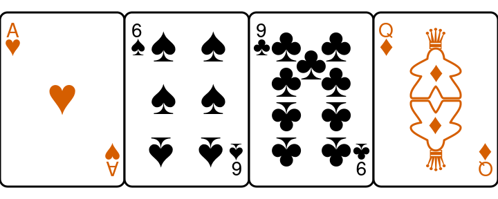
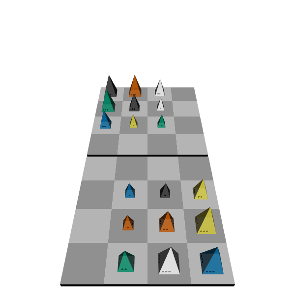
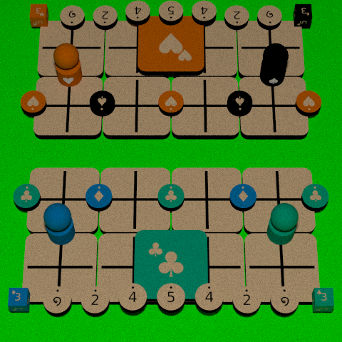
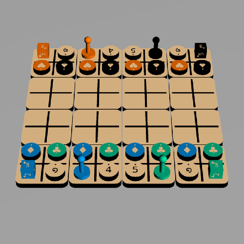

# piecepackr: Board Game Graphics

`piecepackr` is an [R](https://www.r-project.org/) package designed to
make configurable board game graphics. It can be used with the
[ggplot2](https://ggplot2.tidyverse.org/),
[grid](https://www.rdocumentation.org/packages/grid),
[rayrender](https://www.rayrender.net/),
[rayvertex](https://www.rayvertex.com/), and
[rgl](https://www.rdocumentation.org/packages/rgl) graphics packages to
make board game diagrams, board game animations, and custom [Print &
Play
layouts](https://trevorldavis.com/piecepackr/pages/print-and-play-pdfs.html).
By default it is configured to make [piecepack](#piecepack) game
diagrams, animations, and "Print & Play" layouts but can be configured
to make graphics for other board game systems as well.

## Built-in Game Systems

The function `game_systems()` returns configurations for multiple public
domain game systems:

### Checkers

`game_systems()` returns a `checkers1` and `checkers2` configuration
which has checkered and lined "boards" with matching checker "bits" in
various sizes and colors.

    library("piecepackr")
    library("tibble")
    df_board <- tibble(piece_side = "board_face", suit = 3, rank = 8,
                   x = 4.5, y = 4.5)
    df_w <- tibble(piece_side = "bit_face", suit = 6, rank = 1,
                   x = rep(1:8, 2), y = rep(1:2, each=8))
    df_b <- tibble(piece_side = "bit_face", suit = 1, rank = 1,
                   x = rep(1:8, 2), y = rep(7:8, each=8))
    df <- rbind(df_board, df_w, df_b)
    df$cfg <- "checkers1"
    pmap_piece(df, envir=game_systems(), default.units="in", 
               trans=op_transform, op_scale=0.5)

### Dice

`game_systems()` returns several configurations for dice:

-   The `dice` configuration makes standard 6-sided dice with pips.
-   The `dominoes_chinese` and `dominoes_chinese_black` configurations
    have Asian-style pipped dice.
-   The `dice_d4`, `dice_numeral`, `dice_d8`, `dice_d10`,
    `dice_d10_percentile`, `dice_d12`, and `dice_d20` configurations
    provide the seven [polyhedral
    dice](https://en.wikipedia.org/wiki/Dice#Polyhedral_dice) most
    commonly used by wargames, roleplaying games, and trading card
    games.
-   The `dice_fudge` configuration make the six-sided [Fudge
    dice](https://en.wikipedia.org/wiki/Fudge_(role-playing_game_system)#Fudge_dice)
    with two plus, two minus, and two blank faces most commonly used in
    the
    [Fudge](https://en.wikipedia.org/wiki/Fudge_(role-playing_game_system))
    and
    [Fate](https://en.wikipedia.org/wiki/Fate_(role-playing_game_system))
    roleplaying games.

<!-- -->

    library("piecepackr")
    envir <- game_systems()
    dice <-  c("d4", "numeral", "d8", "d10_percentile", "d10", "d12", "d20")
    cfg <- paste0("dice_", dice)
    grid.piece("die_face", suit = c(1:6, 1), rank = 1:7,
               cfg = cfg, envir = envir, x = 1:7, y = 1, 
               default.units = "in", op_scale = 0.5)

### Dominoes

`game_systems()` returns seven different configurations for double-18
dominoes:

1.  `dominoes`
2.  `dominoes_black`
3.  `dominoes_blue`
4.  `dominoes_green`
5.  `dominoes_red`
6.  `dominoes_white` (identical to `dominoes`)
7.  `dominoes_yellow`

The `dominoes_chinese` and `dominoes_chinese_black` configurations
support [Chinese
dominoes](https://en.wikipedia.org/wiki/Chinese_dominoes).

    library("piecepackr")
    library("tibble")
    envir <- game_systems("dejavu")

    colors <- rep(c("black", "red", "green", "blue", "yellow", "white"), 2)
    df_dominoes <- tibble(piece_side = "tile_face", suit=1:12, rank=7:18+1,
                          cfg = paste0("dominoes_", colors),
                          x=rep(4:1, 3), y=rep(2*3:1, each=4))
    df_tiles <- tibble(piece_side = "tile_back", suit=1:3, rank=1:3, 
                       cfg="piecepack", x=5.5, y=c(2,4,6))
    df_dice <- tibble(piece_side = "die_face", suit=1:6, rank=1:6, 
                      cfg="dice", x=6, y=0.5+1:6)
    df_coins1 <- tibble(piece_side = "coin_back", suit=1:4, rank=1:4, 
                        cfg="piecepack", x=5, y=0.5+1:4)
    df_coins2 <- tibble(piece_side = "coin_face", suit=1:2, rank=1:2,
                        cfg="piecepack", x=5, y=0.5+5:6)
    df <- rbind(df_dominoes, df_tiles, df_dice, df_coins1, df_coins2)

    pmap_piece(df, default.units="in", envir=envir, op_scale=0.5, trans=op_transform)

### Go

`game_systems()` returns a `go` configuration for
[Go](https://en.wikipedia.org/wiki/Go_(game)) boards and stones in a
variety of colors and sizes. Here are is [an example
diagram](https://trevorldavis.com/piecepackr/go.html) for a game of
[Multi-player
go](https://en.wikipedia.org/wiki/Go_variants#Multi-player_Go) plotted
using [rgl](https://www.rdocumentation.org/packages/rgl):

### Piecepack

`game_systems()` returns three different [piecepack](#piecepack)
configurations:

1.  `piecepack`
2.  `playing_cards_expansion`
3.  `dual_piecepacks_expansion`

Plus a configuration for a `subpack` aka "mini" piecepack and a
`hexpack` configuration.

The piecepack configurations also contain common piecepack accessories
like piecepack pyramids, piecepack matchsticks, and piecepack saucers.

### Playing Cards

`game_systems()` returns `playing_cards`, `playing_cards_colored`, and
`playing_cards_tarot` (French Tarot) configurations for making diagrams
with various decks of playing cards.

    library("piecepackr")
    library("tibble")
    envir <- game_systems("dejavu", round=TRUE)

    df <- tibble(piece_side = "card_face", 
                 x=1.25 + 2.5 * 0:3, y=2, 
                 suit=1:4, rank=c(1,6,9,12),
                 cfg = "playing_cards")
    pmap_piece(df, default.units="in", envir=envir)

### Other included games and components

-   An `alquerque` configuration that produces "boards"/"bits" for
    [Alquerque](https://en.wikipedia.org/wiki/Alquerque) in a variety of
    colors.
-   `chess1` and `chess2` configurations with checkered "boards" and
    matching chess "bits" (currently "disc" pieces instead of "Staunton"
    pieces).
-   A `meeples` configuration that produces "meeple" bits in a variety
    of colors.
-   A `morris` configuration that can produce
    [Three/Six/Seven/Nine/Twelve men's
    morris](https://en.wikipedia.org/wiki/Nine_men%27s_morris)
    "board"/"bits" in a variety of colors.
-   A `reversi` configuration that can produce "boards"/"bits" for
    [Reversi](https://en.wikipedia.org/wiki/Reversi) in a variety of
    colors.

## Looney Pyramids

Configurations for the proprietary Looney Pyramids aka Icehouse Pieces
game system by Andrew Looney can be found in the companion R package
`piecenikr`: <https://github.com/piecepackr/piecenikr>

## API Intro

### grid.piece() ({grid})

`grid.piece()` is the core function that can used to draw board game
components (by default [piecepack](#piecepack) game components) using
[grid](https://www.rdocumentation.org/packages/grid):

    library("piecepackr")
    g.p <- function(...) { grid.piece(..., default.units="in") }
    g.p("tile_back", x=0.5+c(3,1,3,1), y=0.5+c(3,3,1,1))
    g.p("tile_back", x=0.5+3, y=0.5+1)
    g.p("tile_back", x=0.5+3, y=0.5+1)
    g.p("die_face", suit=3, rank=5, x=1, y=1)
    g.p("pawn_face", x=1, y=4, angle=90)
    g.p("coin_back", x=3, y=4, angle=180)
    g.p("coin_back", suit=4, x=3, y=4, angle=180)
    g.p("coin_back", suit=2, x=3, y=1, angle=90)

### configuration lists

One can use [lists to
configure](https://trevorldavis.com/piecepackr/configuration-lists.html)
to quickly adjust the appearance of the game components drawn by
`grid.piece`:

    library("piecepackr")
    dark_colorscheme <- list(
        suit_color="darkred,black,darkgreen,darkblue,black",
        invert_colors.suited=TRUE, border_color="black", border_lex=2
    )
    piecepack_suits <- list(
        suit_text="\U0001f31e,\U0001f31c,\U0001f451,\u269c,\uaa5c", # 🌞,🌜,👑,⚜,꩜
        suit_fontfamily="Noto Emoji,Noto Sans Symbols2,Noto Emoji,Noto Sans Symbols,Noto Sans Cham",
        suit_cex="0.6,0.7,0.75,0.9,0.9"
    )
    traditional_ranks <- list(use_suit_as_ace=TRUE, rank_text=",a,2,3,4,5")
    cfg <- c(piecepack_suits, dark_colorscheme, traditional_ranks)
    g.p <- function(...) {
        grid.piece(..., default.units="in", cfg=pp_cfg(cfg))
    }
    g.p("tile_back", x=0.5+c(3,1,3,1), y=0.5+c(3,3,1,1))
    g.p("tile_back", x=0.5+3, y=0.5+1)
    g.p("tile_back", x=0.5+3, y=0.5+1)
    g.p("die_face", suit=3, rank=5, x=1, y=1)
    g.p("pawn_face", x=1, y=4, angle=90)
    g.p("coin_back", x=3, y=4, angle=180)
    g.p("coin_back", suit=4, x=3, y=4, angle=180)
    g.p("coin_back", suit=2, x=3, y=1, angle=90)

### custom grob functions

One can even specify [custom grob
functions](https://trevorldavis.com/piecepackr/custom-grob-functions.html)
to completely customize the appearance of one's game pieces. piecepackr comes with a variety of convenience
functions such as pp\_shape() to
facilitate creating custom game pieces. Here is an example of creating
"patterned" checkers using `pp_shape()` objects' `pattern()` method
powered by the suggested package
[gridpattern](https://github.com/trevorld/gridpattern):

    library("grid")
    library("gridpattern")
    library("piecepackr")

    tilings <- c("hexagonal", "snub_square", "pythagorean",
                 "truncated_square", "triangular", "trihexagonal")
    patternedCheckerGrobFn <- function(piece_side, suit, rank, cfg) {
        opt <- cfg$get_piece_opt(piece_side, suit, rank)
        shape <- pp_shape(opt$shape, opt$shape_t, opt$shape_r, opt$back)
        gp <- gpar(col=opt$suit_color, fill=c(opt$background_color, "white"))
        pattern_grob <- shape$pattern("polygon_tiling", type = tilings[suit],
                                      spacing = 0.3, name = "pattern",
                                      gp = gp, angle = 0)
        gp_border <- gpar(col=opt$border_color, fill=NA, lex=opt$border_lex)
        border_grob <- shape$shape(gp=gp_border, name = "border")
        grobTree(pattern_grob, border_grob)
    }
    checkers1 <- as.list(game_systems()$checkers1)
    checkers1$grob_fn.bit <- patternedCheckerGrobFn
    checkers1 <- pp_cfg(checkers1)

    x1 <- c(1:3, 1:2, 1)
    x2 <- c(6:8, 7:8, 8)
    df <- tibble::tibble(piece_side = c("board_face", rep_len("bit_back", 24L)),
                         suit = c(6L, rep(c(1L, 3L, 4L, 5L), each = 6L)),
                         rank = 8L,
                         x = c(4.5, x1, rev(x1), x2, rev(x2)),
                         y = c(4.5, rep(c(1,1,1, 2,2, 3, 6, 7,7, 8,8,8), 2)))

    pmap_piece(df, cfg=checkers1, default.units="in")

### oblique 3D projection

`grid.piece` even has some support for drawing 3D diagrams with an
[oblique
projection](https://trevorldavis.com/piecepackr/3d-projections.html):

    library("piecepackr")
    cfg3d <- list(width.pawn=0.75, height.pawn=0.75, depth.pawn=1, 
                  dm_text.pawn="", shape.pawn="convex6", 
                  invert_colors.pawn=TRUE,
                  edge_color.coin="tan", edge_color.tile="tan")
    cfg <- pp_cfg(c(cfg, cfg3d))
    g.p <- function(...) { 
      grid.piece(..., op_scale=0.5, op_angle=45, cfg=cfg, default.units="in") 
    }
    g.p("tile_back", x=0.5+c(3,1,3,1), y=0.5+c(3,3,1,1))
    g.p("tile_back", x=0.5+3, y=0.5+1, z=1/4+1/8)
    g.p("tile_back", x=0.5+3, y=0.5+1, z=2/4+1/8)
    g.p("die_face", suit=3, rank=5, x=1, y=1, z=1/4+1/4)
    g.p("pawn_face", x=1, y=4, z=1/4+1/2, angle=90)
    g.p("coin_back", x=3, y=4, z=1/4+1/16, angle=180)
    g.p("coin_back", suit=4, x=3, y=4, z=1/4+1/8+1/16, angle=180)
    g.p("coin_back", suit=2, x=3, y=1, z=3/4+1/8, angle=90)

### save\_print\_and\_play() and save\_piece\_images()

`save_print_and_play()` makes a "Print & Play" pdf of a configured
piecepack, `save_piece_images()` makes individual images of each
piecepack component:

    save_print_and_play(cfg, "my_piecepack.pdf", size="letter")
    save_piece_images(cfg)

### pmap\_piece()

If you are comfortable using R data frames there is also `pmap_piece()`
that processes data frame input. It accepts an optional `trans` argument
for a function to pre-process the data frames, in particular if desiring
to draw a 3D [oblique
projection](https://trevorldavis.com/piecepackr/3d-projections.html) one
can use the function `op_transform()` to guess both the pieces'
z-coordinates and an appropriate re-ordering of the data frame given the
desired angle of the oblique projection.

    library("dplyr", warn.conflicts=FALSE)
    library("piecepackr")
    library("tibble")
    df_tiles <- tibble(piece_side="tile_back", 
                       x=0.5+c(3,1,3,1,1,1), 
                       y=0.5+c(3,3,1,1,1,1))
    df_coins <- tibble(piece_side="coin_back", 
                       x=rep(1:4, 4), 
                       y=rep(c(4,1), each=8),
                       suit=1:16%%2+rep(c(1,3), each=8),
                       angle=rep(c(180,0), each=8))
    df <- bind_rows(df_tiles, df_coins)
    cfg <- game_systems("dejavu")$piecepack
    pmap_piece(df, cfg=cfg, default.units="in", trans=op_transform, 
               op_scale=0.5, op_angle=135)

### geom\_piece() ({ggplot2})

`geom_piece()` creates [ggplot2](https://ggplot2.tidyverse.org/) "geom"
objects.

    library("ggplot2")
    library("piecepackr")
    envir <- game_systems("sans")
    df_board <- tibble(piece_side = "board_face", suit = 3, rank = 12,
                       x = 4, y = 4)
    df_b <- tibble(piece_side = "bit_face", suit = 2, rank = 1,
                   x = c(2, 3, 3, 4, 4), y = c(6, 5, 4, 5, 2))
    df_w <- tibble(piece_side = "bit_face", suit = 1, rank = 1,
                   x = c(2, 2, 3, 4, 5, 5), y = c(4, 3, 6, 5, 4, 6))
    df <- rbind(df_board, df_w, df_b)

    ggplot(df, aes_piece(df)) +
        geom_piece(cfg = "morris", envir = envir) +
        coord_fixed() +
        scale_x_piece(limits = c(0.5, 7.5)) +
        scale_y_piece(limits = c(0.5, 7.5)) +
        theme_minimal(32) +
        theme(panel.grid = element_blank())

    library("ggplot2")
    library("piecepackr")
    library("ppgames") # remotes::install_github("piecepackr/ppgames")
    library("withr")
    new <- list(piecepackr.cfg = "piecepack",
                piecepackr.envir = game_systems("dejavu", pawn="joystick"),
                piecepackr.op_angle = 90,
                piecepackr.op_scale = 0.80)
    dfc <- ppgames::df_fujisan(seed = 42)
    withr::with_options(new, {
      dft <- op_transform(dfc, as_top = "pawn_face", cfg_class = "character")
      ggplot(dft, aes_piece(dft)) + 
          geom_piece() + 
          coord_fixed() + 
          theme_void()
    })

### piece3d() ({rgl})

`piece3d()` draws pieces using
[rgl](https://www.rdocumentation.org/packages/rgl) graphics.

    library("piecepackr")
    library("piecenikr") # remotes::install_github("piecepackr/piecenikr")
    library("rgl")
    invisible(rgl::open3d())
    rgl::view3d(phi=-45, zoom = 0.9)

    df <- piecenikr::df_martian_chess()
    envir <- c(piecenikr::looney_pyramids(), game_systems("sans3d"))
    pmap_piece(df, piece3d, envir = envir, trans=op_transform,
               scale = 0.98, res = 150)

### piece() ({rayrender})

`piece()` creates [rayrender](https://www.rayrender.net/) objects.

    library("piecepackr")
    library("ppgames") # remotes::install_github("piecepackr/ppgames")
    library("magrittr")
    library("rayrender", warn.conflicts = FALSE)
    df <- ppgames::df_xiangqi()
    envir <- game_systems("dejavu3d", round=TRUE, pawn="peg-doll")
    l <- pmap_piece(df, piece, envir = envir, trans=op_transform, 
                    scale = 0.98, res = 150, as_top="pawn_face")
    light <- sphere(x=5,y=-4, z=30, material=light(intensity=420))
    table <- sphere(z=-1e3, radius=1e3, material=diffuse(color="green")) %>%
             add_object(light)
    scene <- Reduce(rayrender::add_object, l, init=table)
    rayrender::render_scene(scene, 
                            lookat = c(5, 5, 0), lookfrom = c(5, -7, 25), 
                            width = 500, height = 500, 
                            samples=200, clamp_value=8)

### piece\_mesh() ({rayvertex})

`piece_mesh()` creates [rayvertex](https://www.rayvertex.com/) objects.

    library("piecepackr")
    library("ppgames") # remotes::install_github("piecepackr/ppgames")
    library("rayvertex", warn.conflicts = FALSE) # masks `rayrender::r_obj`
    df <- ppgames::df_international_chess()
    envir <- game_systems("dejavu3d", round=TRUE, pawn="joystick")
    l <- pmap_piece(df, piece_mesh, envir = envir, trans=op_transform, 
                    scale = 0.98, res = 150, as_top="pawn_face")
    table <- sphere_mesh(c(0, 0, -1e3), radius=1e3, 
                         material = material_list(diffuse="grey40"))
    scene <- Reduce(rayvertex::add_shape, l, init=table)
    light_info <- directional_light(c(5, -7, 7), intensity = 2.5)
    rayvertex::rasterize_scene(scene, 
                               lookat = c(4.5, 4, 0), 
                               lookfrom=c(4.5, -16, 20),
                               light_info = light_info)

### animate\_piece()

`animate_piece()` creates animations.

    library("gifski")
    library("piecepackr")
    library("ppgames") # remotes::install_github("piecepackr/ppgames")
    library("tweenr")

    envir <- game_systems("dejavu")
    cfg <- as.list(envir$piecepack)
    cfg$suit_color <- "black"
    cfg$background_color.r1 <- "#E69F00"
    cfg$background_color.r2 <- "#56B4E9"
    cfg$background_color.r3 <- "#009E73"
    cfg$background_color.r4 <- "#F0E442"
    cfg$background_color.r5 <- "#D55E00"
    cfg$background_color.r6 <- "#F079A7"
    envir$piecepack <- pp_cfg(cfg)

    ppn_file <- system.file("ppn/relativity.ppn", package = "ppgames")
    game <- read_ppn(ppn_file)[[1]]
    animate_piece(game$dfs, file = "man/figures/README-relativity.gif", 
                  annotate = FALSE,
                  envir = envir, trans = op_transform, op_scale = 0.5, 
                  n_transitions = 3, n_pauses = 2, fps = 7)

<figure>
<figcaption aria-hidden="true">Animation of Marty and Ron Hale-Evans' abstract game Relativity</figcaption>
</figure>

### Further documentation

A slightly longer [intro to piecepackr's
API](https://trevorldavis.com/piecepackr/intro-to-piecepackrs-api.html)
plus several other [piecepackr
articles](https://trevorldavis.com/piecepackr/tag/piecepackr-features.html)
are available at piecepackr's [companion
website](https://trevorldavis.com/piecepackr/) as well as some
[demos](https://trevorldavis.com/piecepackr/pages/about.html#demos) and
pre-configured [Print & Play
PDFs](https://trevorldavis.com/piecepackr/pages/print-and-play-pdfs.html).
More API documentation is also available in the package's built-in [man
pages](https://trevorldavis.com/R/piecepackr/reference/index.html).

### Tak Example

Here we'll show an example of configuring piecepackr to draw diagrams
for the abstract board game
[Tak](https://en.wikipedia.org/wiki/Tak_(game)) (designed by James
Ernest and Patrick Rothfuss).

Since one often plays Tak on differently sized boards one common Tak
board design is to have boards made with colored cells arranged in rings
from the center plus extra symbols in rings placed at the points so it
is easy to see smaller sub-boards. To start we'll write a function to
draw the Tak board.

    library("grid", warn.conflicts=FALSE)
    library("piecepackr")
    grobTakBoard <- function(...) {
        g <- "darkgreen"
        w <- "grey"
        fill <- c(rep(g, 5),
                  rep(c(g, rep(w, 3), g),3),
                  rep(g, 5))
        inner <- rectGrob(x = rep(1:5, 5), y = rep(5:1, each=5),
                     width=1, height=1, default.units="in", 
                     gp=gpar(col="gold", fill=fill, lwd=3))
        outer <- rectGrob(gp=gpar(col="black", fill="grey", gp=gpar(lex=2)))
        circles <- circleGrob(x=0.5+rep(1:4, 4), 
                              y=0.5+rep(4:1, each=4), 
                              r=0.1, default.units="in", 
                              gp=gpar(col=NA, fill="gold"))
        rects <- rectGrob(x=0.5+c(0:5, rep(c(0,5), 4), 0:5), 
                          y=0.5+c(rep(5,6), rep(c(4:1), each=2), rep(0, 6)),
                          width=0.2, height=0.2,
                          gp=gpar(col=NA, fill="orange"), default.units="in")
        grobTree(outer, inner, circles, rects)
    }

Then we'll configure a Tak set and write some helper functions to draw
Tak pieces with it.

    cfg <- pp_cfg(list(suit_text=",,,", suit_color="white,tan4,", invert_colors=TRUE,
                       ps_text="", dm_text="",
                       width.board=6, height.board=6, 
                       depth.board=1/4, grob_fn.board=grobTakBoard,
                       width.r1.bit=0.6, height.r1.bit=0.6, 
                       depth.r1.bit=1/4, shape.r1.bit="rect",
                       width.r2.bit=0.6, height.r2.bit=1/4, 
                       depth.r2.bit=0.6, shape.r2.bit="rect", 
                       width.pawn=0.5, height.pawn=0.5, 
                       depth.pawn=0.8, shape.pawn="circle",
                       edge_color="white,tan4", border_lex=2,
                       edge_color.board="tan", border_color.board="black"))
    g.p <- function(...) { 
        grid.piece(..., cfg=cfg, default.units="in",
                   op_scale=0.7, op_angle=45)
    }
    draw_tak_board <- function(x, y) { 
        g.p("board_back", x=x+0.5, y=y+0.5) 
    }
    draw_flat_stone <- function(x, y, suit=1) { 
        z <- 1/4*seq(along=suit)+1/8
        g.p("bit_back", x=x+0.5, y=y+0.5, z=z, suit=suit, rank=1)
    }
    draw_standing_stone <- function(x, y, suit=1, n_beneath=0, angle=0) {
        z <- (n_beneath+1)*1/4+0.3
        g.p("bit_back", suit=suit, rank=2, 
            x=x+0.5, y=y+0.5, z=z, angle=angle)
    }
    draw_capstone <- function(x, y, suit=1, n_beneath=0) {
        z <- (n_beneath+1)*1/4+0.4
        g.p("pawn_back", x=x+0.5, y=y+0.5, z=z, suit=suit)
    }

Then we'll draw an example Tak game diagram:

    pushViewport(viewport(width=inch(6), height=inch(6)))
    draw_tak_board(3, 3)
    draw_flat_stone(1, 1, 1)
    draw_flat_stone(1, 2, 2)
    draw_flat_stone(2, 4, 1)
    draw_capstone(2, 4, 2, n_beneath=1)
    draw_flat_stone(2, 5, 2)
    draw_flat_stone(3, 4, 1:2)
    draw_flat_stone(3, 3, c(2,1,1,2))
    draw_flat_stone(3, 2, 1:2)
    draw_flat_stone(3, 1, 2)
    draw_standing_stone(4, 2, 2, angle=90)
    draw_flat_stone(5, 2, 1)
    draw_capstone(5, 3, 1)
    popViewport()

## Installation

To install the last version released on CRAN use the following command
in [R](https://www.r-project.org/):

    install.packages("piecepackr")

To install the development version use the following commands:

    install.packages("remotes")
    remotes::install_github("piecepackr/piecepackr")

### Suggested R packages

Although the "core" `{piecepackr}` functionality does not need any
additional software installed some non-"core" functionality needs extra
suggested software to be installed. To install **all** of the suggested
R packages use:

    install.packages("piecepackr", dependencies = TRUE)

or (for the development version):

    install.packages("remotes")
    remotes::install_github("piecepackr/piecepackr", dependencies = TRUE)

Suggested R packages:

**animation**  
`animate_piece()` uses the `{animation}` package to save "html" and
"video" (e.g. mp4 and avi) animations. Additionally, if the `{gifski}`
package is not installed `animate_piece()` will fall back to using
`{animation}` to make "gif" animations.

**ggplot2**  
Required by the `{ggplot2}` bindings `geom_piece()` and its helper
functions `aes_piece()`, `scale_x_piece()`, and `scale_y_piece()`.

**gifski**  
`animate_piece()` uses the `{gifski}` package to save "gif" animations.

**gridpattern**  
The `pp_shape()` object's `pattern()` method uses `{gridpattern}` to
make patterned shapes. In particular can be used to make patterned board
game pieces.

**magick**  
`file2grob()` uses `magick::image_read()` to import images that are not
"png", "jpg/jpeg", or "svg/svgz".

**pdftools**  
`get_embedded_font()` uses `pdftools::pdf_fonts()`. It also requires R
compiled with Cairo support (i.e. `capabilities("cairo") == TRUE`). If
the suggested R package `{systemfonts}` is not installed then
`has_font()` can also fall back on using `get_embedded_font()`.

**rayrender**  
Required for the `{rayrender}` binding `piece()` and the `pp_cfg()`
object's `rayrender_fn()` method.

**rayvertex**  
Required for the `{rayvertex}` binding `piece_mesh()` and the `pp_cfg()`
object's `rayvertex_fn()` method.

**readobj**  
Allows the `{rgl}` bindings to support more game piece shapes; in
particular the "meeple", "halma", and "roundrect" shaped token game
pieces.

**rgl**  
Required for the `{rgl}` binding `piece3d()` and the `pp_cfg()` object's
`rgl_fn()` method. Also required for the `obj_fn()` method for game
pieces with ellipsoid shapes (in particular this may effect
`save_piece_obj()`, `piece()`, `piece3d()`, and/or `piece_mesh()` when
used with the go stones and joystick pawns provided by
`game_systems()`). You may need to [install extra
software](https://github.com/dmurdoch/rgl#installing-opengl-support) for
`{rgl}` to support OpenGL (in addition to WebGL). Consider also
installing `{readobj}` which allows the `{rgl}` bindings to support more
game piece shapes; in particular the "meeple", "halma", and "roundrect"
shaped token game pieces.

**systemfonts**  
`has_font()` preferably uses `{systemfonts}` to determine if a given
font is available. If `{systemfonts}` is not available then `has_font`
can fall back on `{pdftools}` if `capabilities("cairo") == TRUE`.

**tweenr**  
`animate_piece()` needs `{tweenr}` to do animation transitions (i.e. its
`n_transitions` argument is greater than the default zero).

**xmpdf**  
`save_print_and_play()` can use `{xmpdf}` to embed bookmarks,
documentation info, and XMP metadata into pdf print-and-play files. You
may also need the system tools ghostscript, pdftk, and/or exiftool.

### Other suggested software

The default piecepackr `pp_cfg()` configuration and the default game
systems returned by `game_systems()` should work out on the box on most
modern OSes including Windows without the user needing to mess with
their system fonts. However `game_systems(style = "dejavu")` requires
that the [Dejavu Sans](https://dejavu-fonts.github.io/Download.html)
font is installed.

For more advanced `{piecepackr}` configurations you'll want to install
additional Unicode fonts and Windows users are highly recommended to use
and install piecepackr on "Ubuntu on Bash on Windows" if planning on
using Unicode symbols from multiple fonts. The following bash commands
will give you a good selection of fonts (Noto, Quivira, and Dejavu) on
Ubuntu:

    sudo apt install fonts-dejavu fonts-noto 
    fonts_dir=${XDG_DATA_HOME:="$HOME/.local/share"}/fonts
    curl -O http://www.quivira-font.com/files/Quivira.otf
    mv Quivira.otf $fonts_dir/
    curl -O https://noto-website-2.storage.googleapis.com/pkgs/NotoEmoji-unhinted.zip
    unzip NotoEmoji-unhinted.zip NotoEmoji-Regular.ttf
    mv NotoEmoji-Regular.ttf $fonts_dir/
    rm NotoEmoji-unhinted.zip

Certain `{piecepackr}` features works best if the version of R installed
was compiled with support for Cairo:

-   A subset of game system configurations use Unicode glyphs. The
    "cairo" graphics devices support Unicode glyphs.
-   3D `{grid}` renderings for certain pieces like dice and pyramids are
    enhanced if the graphic device supports the "affine transformation"
    feature. In recent versions of R the "cairo" graphics devices
    support the "affine transformation" feature.
-   The function `get_embedded_font()` needs support for the
    `cairo_pdf()` function (which embeds fonts in the pdf) and by
    default `render_piece()` and `save_print_and_play()` may try to use
    "cairo" graphics devices.

Fortunately R is typically compiled with support for Cairo. One can
confirm that R was compiled with support for Cairo via R's
`capabilities()` function:

    > capabilities("cairo")
    cairo
     TRUE

## Frequently Asked Questions

### Where should I ask questions?

-   For general questions about piecepackr one may use the project
    mailing list: <https://groups.google.com/forum/#!forum/piecepackr>
-   If you have a bug report or a feature request please use the issue
    tracker: <https://github.com/piecepackr/piecepackr/issues>

### What is the package licence?

The **code** of this software package is licensed under the [MIT
license](https://opensource.org/license/mit/).

Graphical assets generated using configurations returned by
`game_systems()` should be usable without attribution:

1.  Uses fonts which should allow you to embed them in images/documents
    without requiring attribution.
2.  Does not embed any outside copyrighted images.[1]
3.  Only contains public domain game systems which should not suffer
    from copyright / trademark issues.

However, third party game configurations [may be encumbered by copyright
/ trademark
issues](https://trevorldavis.com/piecepackr/licenses-faq.html#piecepackr-output).

### Why does the package sometimes use a different font then the one I instructed it to use for a particular symbol?

Some of R's graphic devices (`cairo_pdf()`, `svg()`, and `png()`) use
`Cairo` which uses `fontconfig` to select fonts. `fontconfig` picks what
it thinks is the 'best' font and sometimes it annoyingly decides that
the font to use for a particular symbol is not the one you asked it to
use (although sometimes the symbol it chooses instead still looks nice
in which case maybe you shouldn't sweat it). It is hard but not
impossible to [configure which
fonts](https://eev.ee/blog/2015/05/20/i-stared-into-the-fontconfig-and-the-fontconfig-stared-back-at-me/)
are dispatched by `fontconfig`. A perhaps easier way to guarantee your
symbols will be dispatched would be to either make a new font and
re-assign the symbols to code points in the Unicode "Private Use Area"
that aren't used by any other font on your system or to simply
temporarily move (or permanently delete) from your system font folders
the undesired fonts that `fontconfig` chooses over your requested fonts:

    # temporarily force fontconfig to use Noto Emoji instead of Noto Color Emoji in my piecepacks on Ubuntu 18.04
    $ sudo mv /usr/share/fonts/truetype/noto/NotoColorEmoji.ttf ~/
    ## Make some piecepacks
    $ sudo mv ~/NotoColorEmoji.ttf /usr/share/fonts/truetype/noto/

Also as a sanity check use the command-line tool `fc-match` (or the R
function `systemfonts::match_font()`) to make sure you specified your
font correctly in the first place (i.e. `fc-match "Noto Sans"` on my
system returns "Noto Sans" but `fc-match "Sans Noto"` returns "DejaVu
Sans" and not "Noto Sans" as one may have expected). To help determine
which fonts are actually being embedded you can use the
`get_embedded_font()` helper function:

    library("piecepackr")
    fonts <- c('Noto Sans Symbols2', 'Noto Emoji', 'sans')
    chars <- c('♥', '♠', '♣', '♦', '🌞' ,'🌜' ,'꩜')
    get_embedded_font(fonts, chars)
    #     char      requested_font            embedded_font
    # 1      ♥ Noto Sans Symbols2 NotoSansSymbols2-Regular
    # 2      ♠ Noto Sans Symbols2 NotoSansSymbols2-Regular
    # 3      ♣ Noto Sans Symbols2 NotoSansSymbols2-Regular
    # 4      ♦ Noto Sans Symbols2 NotoSansSymbols2-Regular
    # 5       🌞Noto Sans Symbols2                NotoEmoji
    # 6       🌜Noto Sans Symbols2                NotoEmoji
    # 7      ꩜ Noto Sans Symbols2     NotoSansCham-Regular
    # 8      ♥         Noto Emoji                NotoEmoji
    # 9      ♠         Noto Emoji                NotoEmoji
    # 10     ♣         Noto Emoji                NotoEmoji
    # 11     ♦         Noto Emoji                NotoEmoji
    # 12      🌞        Noto Emoji                NotoEmoji
    # 13      🌜        Noto Emoji                NotoEmoji
    # 14     ꩜         Noto Emoji     NotoSansCham-Regular
    # 15     ♥               sans                    Arimo
    # 16     ♠               sans                    Arimo
    # 17     ♣               sans                    Arimo
    # 18     ♦               sans                    Arimo
    # 19      🌞              sans                NotoEmoji
    # 20      🌜              sans                NotoEmoji
    # 21     ꩜               sans     NotoSansCham-Regular

[1] The outline for the meeple shape used in the "meeples" configuration
(also used in some face cards in the playing cards configurations) was
extracted (converted into a dataset of normalized x, y coordinates) from
[Meeple icon](https://game-icons.net/1x1/delapouite/meeple.html) by
[Delapouite](https://delapouite.com/) / [CC BY
3.0](https://creativecommons.org/licenses/by/3.0/). Since "simple
shapes" nor data can be copyrighted under American law this meeple
outline is not copyrightable in the United States. However, in other
legal jurisdictions with stricter copyright laws you may need to give
the proper CC BY attribution if you use any of the meeples.
